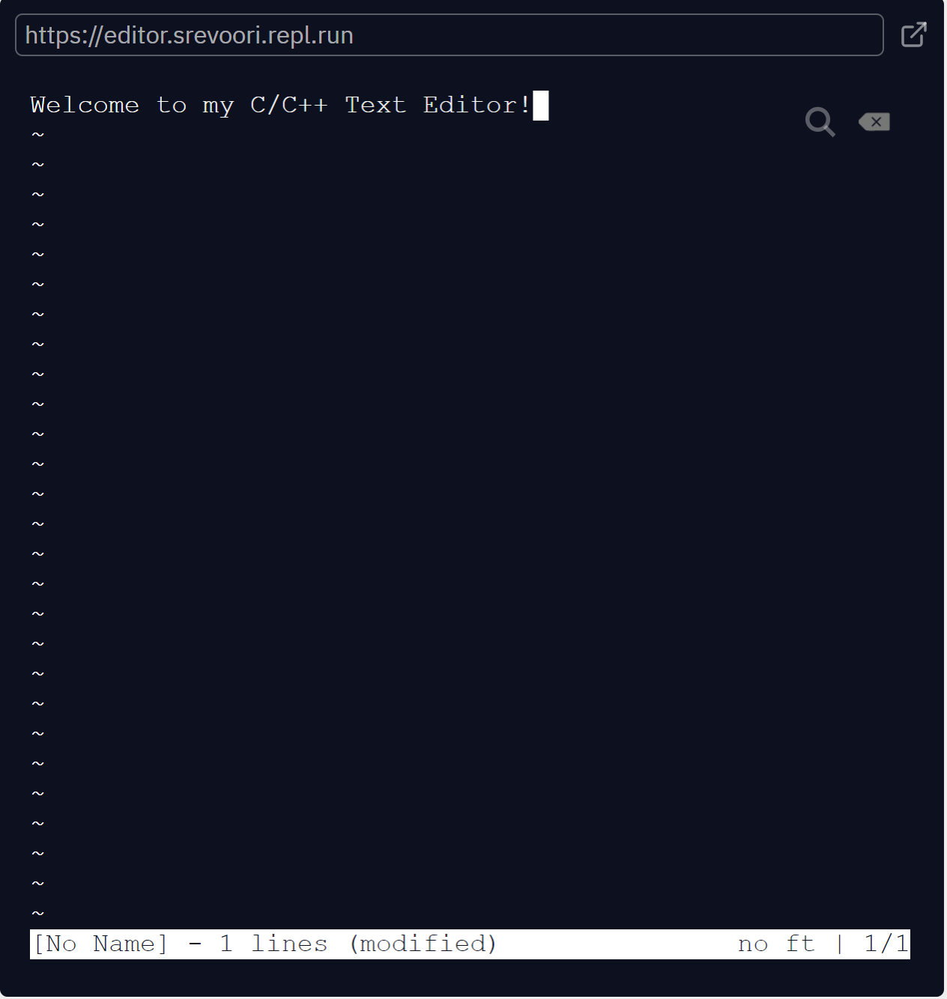

# C-Text-Editor

This is a Text Editor written in C used to edit and compile C and C++. 

This editor implements numerous functionalities common to typical text editors, along with a few novel features:
 
  - Highlighting
  - Color comments
  - Indenting
  - Copy/Paste
  
To run the program and see the results for yourself, download this repo as a zip and run the main.c file. Currently, I am working on a C compiler which will be made to be especially compatible with this C text editor. 

  
